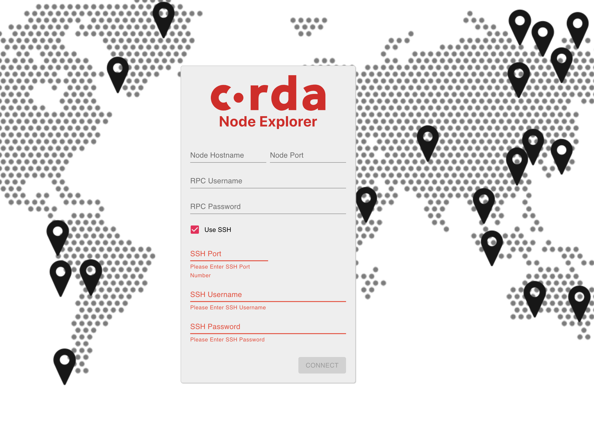
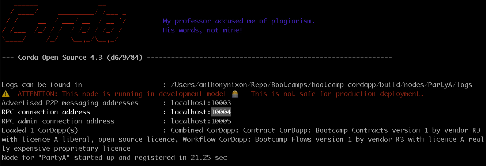
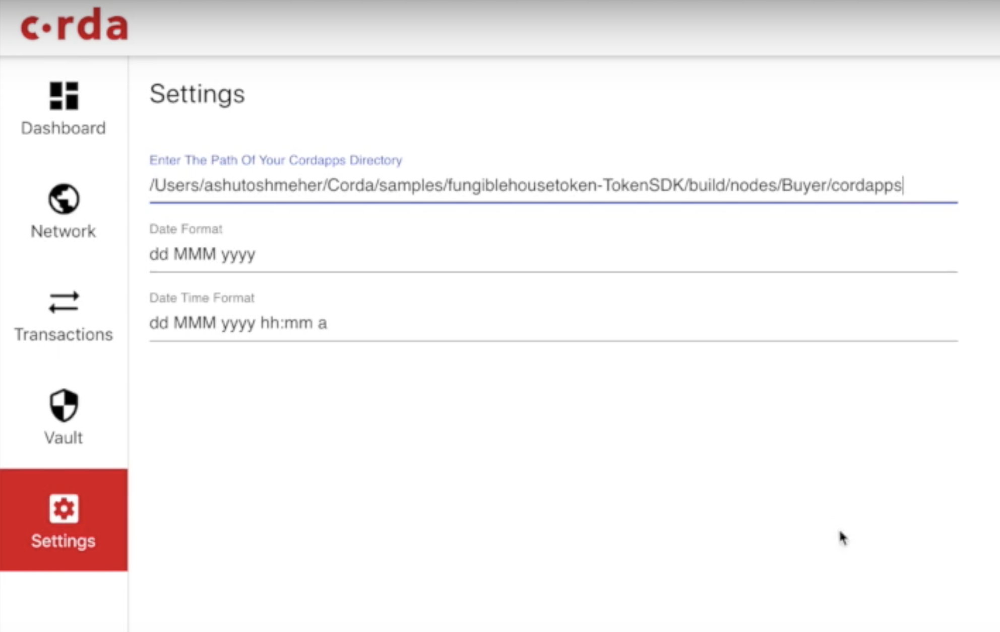
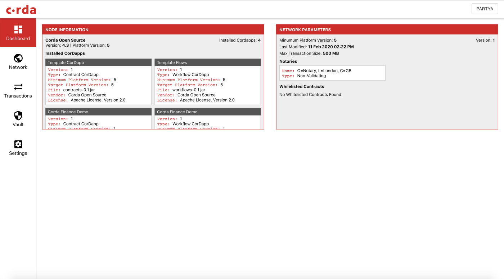
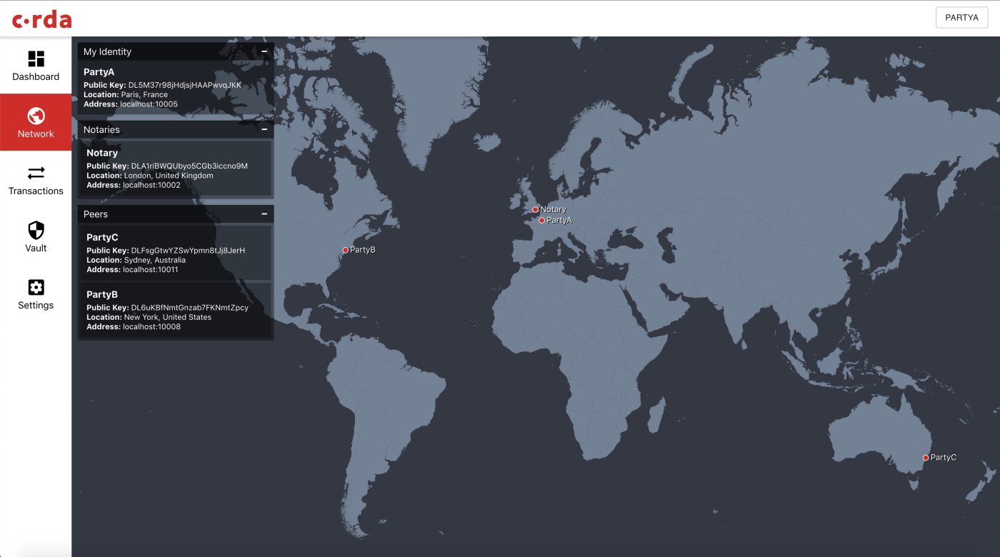
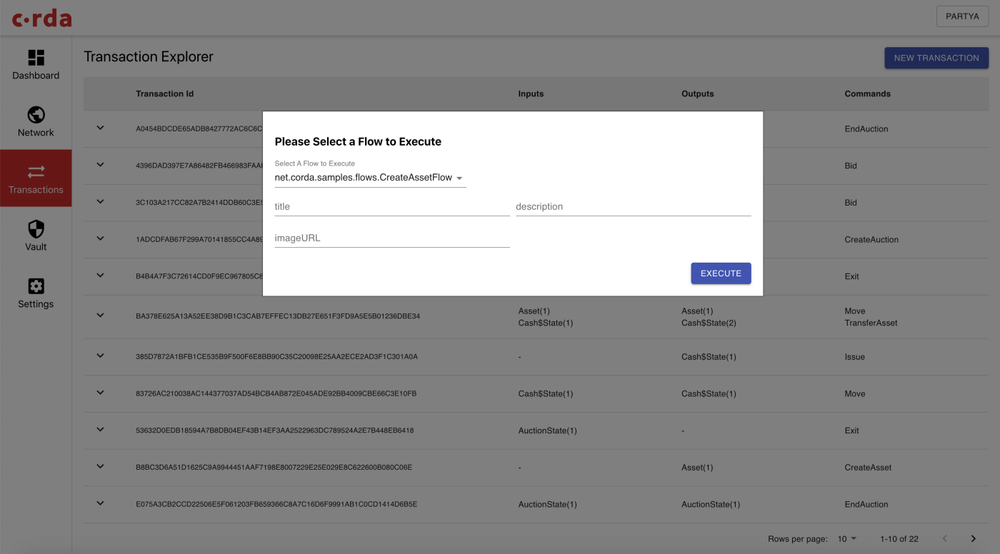
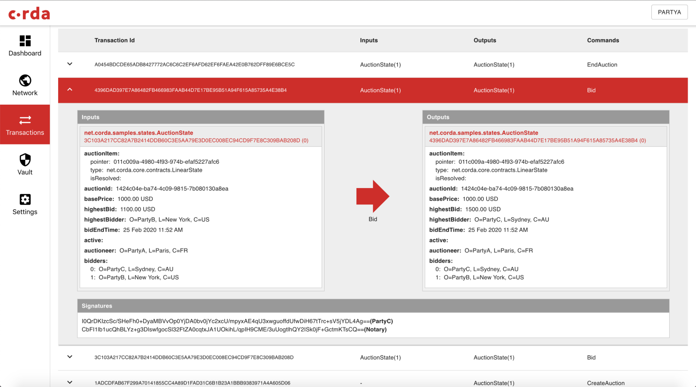
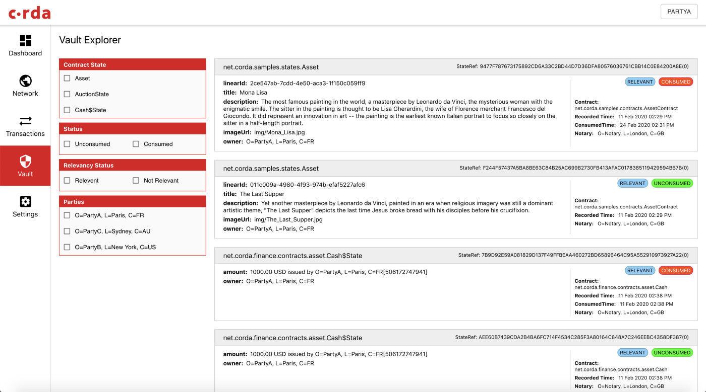

---
aliases:
- /releases/4.4/node-explorer.html
date: '2020-01-08T09:59:25Z'
menu:
  corda-enterprise-4-4:
    parent: corda-ent-4-4-tool-index
tags:
- node
- explorer
title: Node Explorer
---

# Node Explorer



This version of Node Explorer replaces and improves upon the deprecated Corda Finance Node Explorer. [Read more about the retired version of Node Explorer.](node-explorer-corda-finance.md)



The Node Explorer is a visual user interface (UI) that allows you to see your node on the network and perform regular tasks. You can view the contents of your node's vault, and transaction history based real-time query. This includes transactions performed both inside and outside of the Node Explorer UI. 

Use the Node Explorer to:

* see the geographical location of your node and counterparts on your network
* execute CorDapp flows - such as transactions
* review transactions performed in Node Explorer
* explore the contents of your node's vault.

## Install Node Explorer

Node Explorer is a standalone programme that accesses your node and its CorDapps using your security credentials - you do not need to install it directly onto any particular node.  

### Requirements

To use Node Explorer, you need:

* access to a node, either locally or remotely
* your RCP login details for your local node
* SSH credentials for access to a remote node.

Node Explorer is available for Mac OSX, Windows, and Linux.  System requirements are matched to the requirements for operating a Corda node. <!--- check this detail --->

### Download and install

Download your required Node explorer from the GitHub repository:

[https://github.com/corda/node-explorer/releases](https://github.com/corda/node-explorer/releases)

Once downloaded, run the installer on your machine in the way you would any other app.

## Access your node with Node Explorer

You can access any node with Node Explorer using the node's login credentials. If you are accessing a local Node, you can use the node's RPC login details. To access a remote node, you need the SSH credentials.

To log in to a local node:

1. Open Node Explorer.

2. In the Host Name field, type **localhost**.

3. In the Node Port field, enter the RPC connection address for your node. You can find this address by accessing your node through the command line - you will see the **RPC connection address** listed towards the top of your Node's key information.

4. Enter the username and password you would use to access your node.

The Node Explorer dashboard is shown. If you are connecting to this node for the first time, you can now configure the explorer to access your node's CorDapps.
<!--- Ask if this information is saved or if you have to do this every time you access NE --->

To log in to a remote node:

1. Open Node Explorer.

2. In the login screen, check the **Use SSH** box.

    Fields for accessing the node with SSH appear.

3. Enter the SSH Port for your remote node.

4. Enter the user name and password

The Node Explorer dashboard is shown. If you are connecting to this node for the first time, you can now configure the explorer to access your node's CorDapps.

## Configure Node Explorer to access CorDapps on your node

Before you can start using Node Explorer to execute flows, you need to add the directory of your CorDapps. This enables the explorer to discover the required parameters for each flow.

To add your CorDapp directory:

1. From the Node Explorer dashboard screen, click **Settings** in the left hand menu.

2. On the settings screen, add the required directory path in the **Enter the path of your CorDapps directory** field. This is the folder where all the CorDapps are kept for your node.

3. Use the **Date format** and **Date time format** fields to specify the expected date and time formats used by your CorDapps. If you do not enter anything here, the defaults shown are used.

You have configured Node Explorer so it can now access the CorDapps for this node.

## Use the dashboard to get an overview of your nodes

The dashboard is the first screen that opens when you start Node Explorer.

The dashboard shows details and diagnostics of two aspects of your node - **Node information** and **Network Parameters**.

The **Node information** panel tells you:

* the version of Corda your node is using
* the CorDapps that have been detected by Node Explorer, based on the directory you provided
* basic parameters and details of each individual CorDapp.

The **Network parameters** panel tells you:

* the Minimum Platform Version (MPV) for nodes on this network
* the maximum transaction size for the network
* Notaries on the network, and their status as signatory or non-signatory
* Whitelisted contracts.

## View the geo-location of your node and network peers

To see a geographical view of your network, click **Network** in the left hand menu of the Dashboard screen.

On the network screen, you can see your Node's location, and the location of peers on your network.

## Execute transaction flows

Node Explorer allows you to execute transaction flows using the CorDapps you have available to your node.

You can execute each flow by completing the required information in the UI, without any additional coding. Node Explorer identifies the required fields in your CorDapps, and presents them for you to complete.

To execute a transaction flow:

1. From the Node Explorer dashboard screen, click **Transactions** in the left hand menu.

    The **Transactions explorer** screen is displayed.

2. Click the **New transaction** button in the top right corner.

3. In the **Execute flow** dialogue box, select the required flow from the drop-down menu. This is a list of all available flows based on the CorDapps you have shared with Node Explorer.

4. In the dialogue box, enter the required parameters for your flow. The information requested here is dynamically populated using your CorDapp's parameters, so you can expect it to be different from flow to flow.

5. Click **Execute**.

You have executed a flow. If your flow has been executed successfully, a success message is displayed along with a transaction ID.

## View details of a transaction

You can also review transactions on your node in detail using Node Explorer.

To review a transaction, click **Transactions** from the menu in the Dashboard screen.

Select the required transaction. The transaction details are displayed, including generic information as well as dynamically generated information, depending on the type of transaction you are viewing.

The screen is organised to show you the inputs and outputs of the new transaction state that exists as a result of an executed flow. There can be multiple inputs and outputs for each transaction - for example, when a loan has been issued and then partly repaid.

## Explore your node's vault

The vault contains information about all of the transaction history on your node. You can use the dynamically populated filters to explore transactions of all types, for example transactions with a Contract state type of `CashState`.

As the filters are generated dynamically, they vary from node to node, depending on the kind of transactions that exist in the vault.
